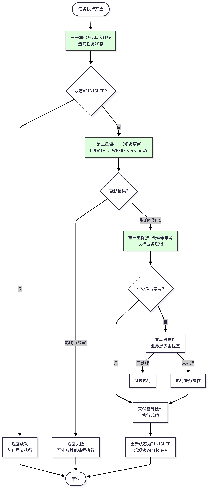

# DisruptFlow：高性能可靠异步任务编排引擎

###  项目定位

**DisruptFlow** 是一款融合了 **LMAX Disruptor 无锁队列** 与 **本地消息表（Transactional Outbox）** 模式的异步任务框架。它专门解决分布式环境下，高并发链路中“异步化操作”与“数据最终一致性”难以兼得的痛点。

---

###  核心架构设计 (Architectural Design)

* **高性能内核：** 摒弃传统的 `BlockingQueue`，采用基于 **RingBuffer** 的无锁并发模型。通过 **CAS (Compare and Swap)** 操作及 **Cache Line Padding（消除伪共享）** 机制，彻底榨干单机 CPU 性能，实现微秒级调度。
* **可靠性屏障：** * **本地消息表模式：** 业务逻辑与任务持久化共享同一个 DB 事务，确保“动作执行”与“任务记录”的**强原子性**。
* **事务钩子（Hook）：** 挂载 Spring `TransactionSynchronization`，仅在事务 `afterCommit` 后推送至内存，规避了由于数据库隔离级别导致的“消息早于数据”的可见性异常。

* **智能重试与退避：**
* **混合重试架构：** 内存执行失败后，任务进入 **RocketMQ 延迟队列**。
* **指数退避算法：** 自动根据失败次数调节重试间隔（如 ），有效缓解下游服务压力，防止雪崩。

---
### 核心流程
#### 主流程

#### RocketMQ延迟重试流程

#### 幂等保护机制

####  异常处理与告警流程

####  完整业务流程泳道图

---

### 技术亮点 (Technical Highlights)
* **三重幂等保护机制：** 针对重试场景，引擎强制执行 **“状态预检 + 乐观锁（Version）CAS 更新 + 处理类幂等校验”**，确保任务在弱网络环境下不被重复触发。
* **灵活的任务编排 (DAG Support)：**
支持基于 `Lifecycle` 的任务链定义。通过实现 `TaskProcessor` 接口，开发者可以像搭积木一样编排并行或串行的异步任务流（如：取消订单时并行执行退款与库存回滚）。
* **自愈与监控：**
内置企业微信告警集成，当任务达到最大重试阈值（Dead Letter Condition）时自动挂起并通知人工介入，实现全生命周期监控。

---

###  方案对比 (Decision Analysis)

| 特性 | 纯 MQ 异步 | 线程池 (ThreadPoolExecutor) | **DisruptFlow (本项目)** |
| --- | --- | --- | --- |
| **执行延迟** | 中 (受网络 RTT 影响) | 极低 (进程内) | **极低 (内存级无锁调度)** |
| **数据可靠性** | 高 (依赖 MQ 持久化) | 低 (宕机内存数据丢失) | **极高 (DB 事务保障)** |
| **吞吐能力** | 10k+ (受限于 IO) | 50k+ (受限于锁竞争) | **500k+ (无锁并发控制)** |
| **一致性保障** | 需配合分布式事务/手动补偿 | 无法保证一致性 | **本地事务 + 最终一致性** |

---

###  典型应用场景

* **核心交易链路：** 支付回调后的多渠道积分发放、权益到账、流水对账。
* **高并发回滚场景：** 订单超时/主动取消后，涉及运单、库存、促销、支付等多系统的可靠回滚。
* **削峰填谷 + 最终一致性：** 瞬时高流量冲击下，先通过本地消息表快速落地，再由 Disruptor 稳定消费，确保业务链条不断裂。
